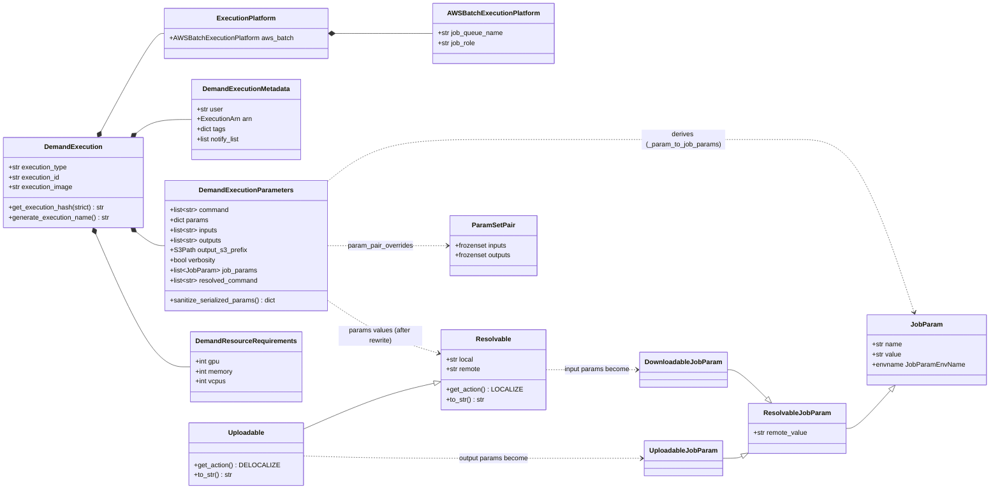
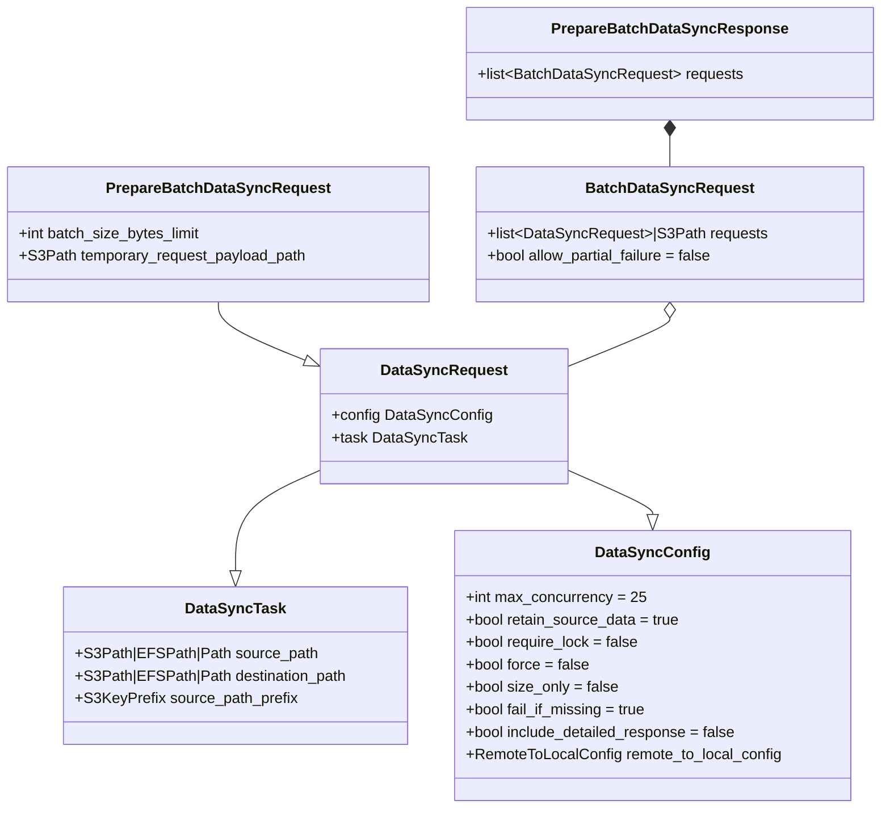
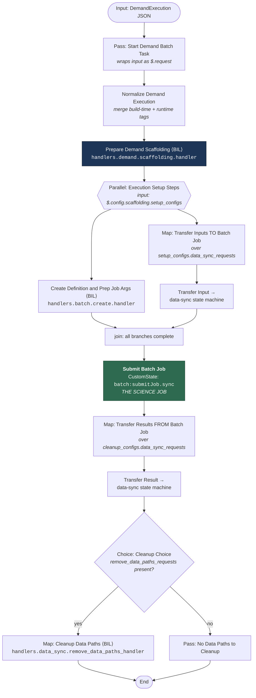
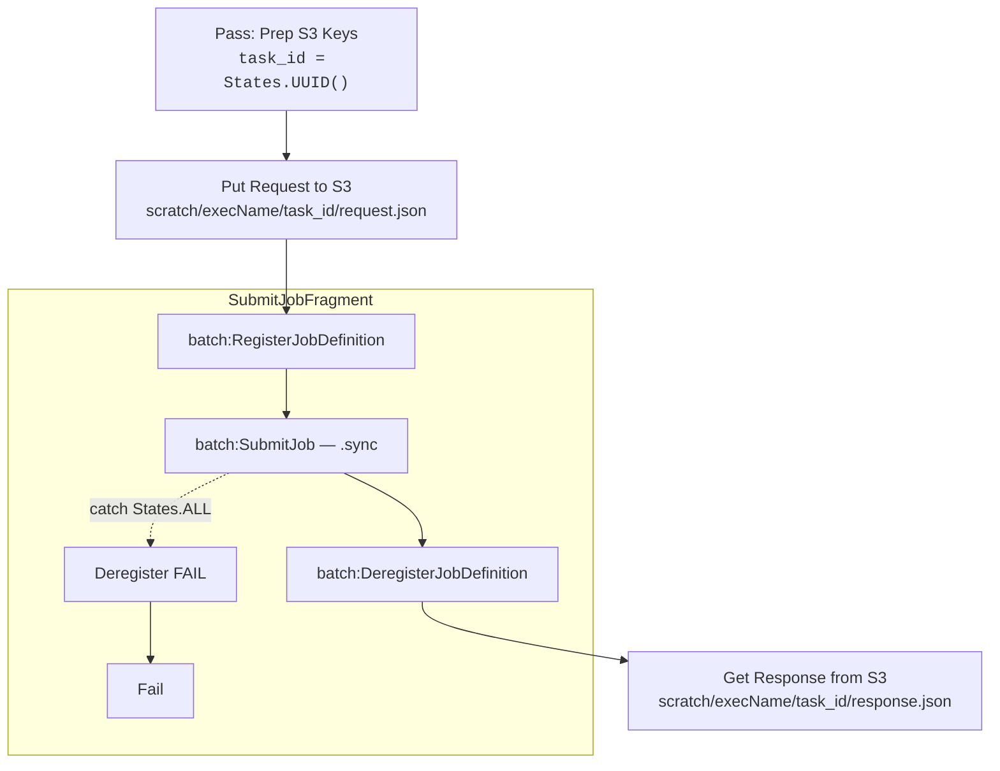
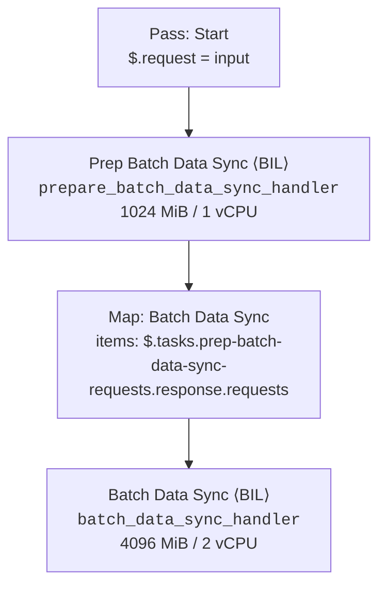
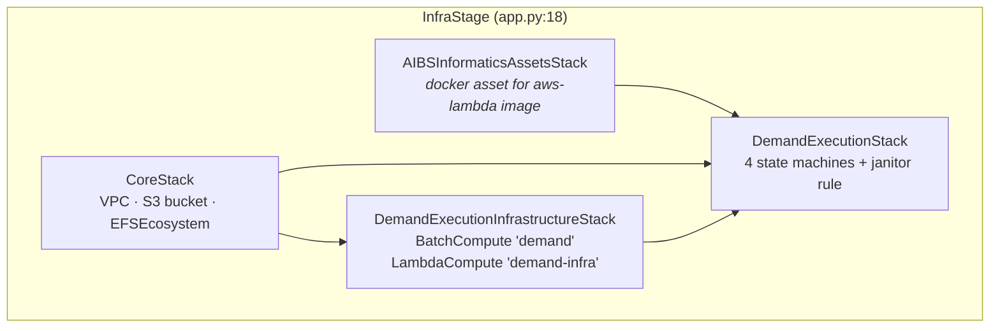

# Demand Execution — Design Reference

**Status:** Reference documentation — describes the system as deployed today
**Last verified against code:** 2026-08-09
**Scope:** This document spans **four repositories**. Every structural claim is cited as
`repo/path/file.py:line`.

| Repo | Role in demand execution |
|---|---|
| `aibs-informatics-core` | Pure models and utilities. No AWS calls. |
| `aibs-informatics-aws-utils` | AWS-touching primitives: S3 transfer, EFS path translation, Batch job construction. |
| `aibs-informatics-aws-lambda` | The handlers. Despite the name, these run as **Batch jobs**, not Lambda functions. |
| `aibs-informatics-cdk-lib` | Infrastructure and orchestration: Step Functions topology, EFS, Batch, the reference app. |

> Paths below are written relative to each repo's `src/` root, e.g.
> `core:models/demand_execution/model.py:30` means
> `aibs-informatics-core/src/aibs_informatics_core/models/demand_execution/model.py` line 30.
> Short repo keys: `core`, `aws-utils`, `lambda`, `cdk`.

> This file is deliberately **not** in `mkdocs.yml`'s `nav`, so it does not appear in the
> published site. See also the companion spike brief
> `docs/developer/s3-files-input-mount-spike.md` (branch `spike/s3-files-input-mount-brief`).

---

## Table of contents

1. [What a demand execution is](#1-what-a-demand-execution-is)
2. [The object model](#2-the-object-model)
3. [The execution graph](#3-the-execution-graph)
4. [The data flow](#4-the-data-flow)
5. [The infrastructure](#5-the-infrastructure)
6. [Extension points and sharp edges](#6-extension-points-and-sharp-edges)
7. [In-flight work](#7-in-flight-work)
8. [Verified / not verified](#8-verified--not-verified)

---

## 1. What a demand execution is

A **demand execution** is one scientific workload run on demand: a container image, a command,
and a bag of named parameters, some of which point at data in S3. The system's job is to make
that command runnable — stage the input objects out of S3 onto a shared POSIX filesystem, hand
the container a set of environment variables whose values are *local paths* rather than S3 URIs,
run it on AWS Batch with the right CPU/memory/GPU, copy whatever it wrote back to S3, and delete
the scratch data.

The domain problem this shape solves is that genomics tooling reads and writes ordinary files.
A caller submits `s3://bucket/sample.bam` and a command like `run.sh --in ${INPUT_BAM}`; the
container sees `INPUT_BAM=/opt/scratch/exec-123/tmp96b35153` and a real file at that path. The
S3-to-POSIX translation, the placement of that file, and its cleanup are the system's
responsibility, not the science tool's.

The other structural driver is **cost separation**. Staging a terabyte out of S3 is I/O-bound and
wants cheap instances; the science job is CPU/GPU-bound and wants expensive ones. Running them as
separate Batch jobs against shared EFS lets each phase size its own compute. This is why the
system is a workflow rather than a single container that does its own downloads.

### The single most important structural fact

**The handlers in `aibs-informatics-aws-lambda` do not run as Lambda functions.** They run as AWS
Batch jobs. A Step Functions fragment (`BatchInvokedLambdaFunction`,
`cdk:constructs_/sfn/fragments/informatics/batch.py:55`) writes the handler's JSON payload to an
S3 scaffolding bucket, submits a Batch job whose container is told which handler to import and
where its payload lives, then reads the response back out of S3.

Two reasons this is deliberate, both load-bearing:

1. **Lambda supports mounting exactly one EFS file system.** The system needs the shared volume
   and the scratch volume mounted simultaneously.
2. **Cost separation** — see above. The transfer handlers run on `lambda-*` Batch environments
   built from small/medium instance types (`cdk:constructs_/service/compute.py`, `LambdaCompute`),
   while the science job runs on the `demand` on-demand environment.

The consequence is that a single demand execution involves roughly ten Batch jobs of
infrastructure wrapped around one Batch job of actual science. Precisely, the job count is:

```
total Batch jobs = 2 + I + 1 + O + C
                   │   │   │   │   └── cleanup: 0, 1, or 2 (cleanup_inputs, cleanup_working_dir)
                   │   │   │   └────── one data-sync job per output parameter
                   │   │   └────────── the science job
                   │   └────────────── one data-sync job per input parameter
                   └────────────────── scaffolding + create-job-definition
```

A typical execution with 3 inputs and 2 outputs runs 9 infrastructure jobs and 1 science job.

Each `BatchInvokedLambdaFunction` invocation additionally **registers a fresh Batch job definition,
submits against it, and deregisters it** (`cdk:constructs_/sfn/fragments/batch.py:129`) — so the
Batch API traffic per execution is several times the job count.

---

## 2. The object model

### 2.1 Demand execution models (`aibs-informatics-core`)

All models are Pydantic v2 (`PydanticBaseModel`, `core:models/base/_pydantic_model.py:20`) with
`extra="ignore"` and camelCase alias generation.



Definitions: `DemandExecution` `core:models/demand_execution/model.py:17`,
`DemandExecutionParameters` `core:models/demand_execution/parameters.py:58`,
`DemandExecutionMetadata` `core:models/demand_execution/metadata.py:11`,
`ExecutionPlatform` `core:models/demand_execution/platform.py:11`,
`DemandResourceRequirements` `core:models/demand_execution/resource_requirements.py:8`,
`Resolvable`/`Uploadable` `core:models/demand_execution/resolvables.py:255,263`,
`JobParam` family `core:models/demand_execution/job_param.py:58,116,137,143`,
`ParamPair`/`ParamSetPair` `core:models/demand_execution/param_pair.py:14,60`.

`Resolvable.to_str()` and `Uploadable.to_str()` return *different* string shapes —
`"{remote} @ {local}"` and `"{local} @ {remote}"` respectively — because they carry opposite
`ResolvableAction` values (`resolvables.py:188-196`). This asymmetry matters; see
[§6.6](#66-sanitize_serialized_params-collapses-resolvables-to-strings).

**The `params` / `inputs` / `outputs` split.** `params` is a flat `dict[str, JsonValue | BaseModel]`.
`inputs` and `outputs` are *lists of keys into `params`* — they do not carry values themselves.
A key listed in `inputs` has its value interpreted as a downloadable resolvable; a key in
`outputs` as an uploadable; everything else is stringified as-is
(`core:models/demand_execution/parameters.py:313-330`). Validation enforces that every key named
in `inputs`/`outputs` exists in `params` and that their env names do not collide
(`parameters.py:97-114`).

`ParamSetPair` (`param_pair.py:60`) expresses which inputs feed which outputs. It is validated
(`parameters.py:116-138`) and exposed through `param_set_pairs` / `job_param_set_pairs`, but
**nothing in the demand execution pipeline currently consumes it** — the scaffolding handler
iterates over `downloadable_job_param_inputs` and `uploadable_job_param_outputs` flatly. It is
model surface awaiting a consumer.

### 2.2 Data sync models (`aibs-informatics-core`, `core:models/data_sync.py`)



Line references: `DataSyncTask:64`, `DataSyncConfig:82`, `DataSyncRequest:95`,
`BatchDataSyncRequest:144`, `PrepareBatchDataSyncRequest:193`,
`PrepareBatchDataSyncResponse:200` — all in `core:models/data_sync.py`.

`DataSyncRequest` is a diamond of `DataSyncTask` (what to move) and `DataSyncConfig` (how), with
`.task` and `.config` properties to split it back apart (`data_sync.py:98-119`).

`BatchDataSyncRequest.requests` is `list[DataSyncRequest] | S3Path` — the S3Path variant is the
escape hatch for Step Functions' 256 KB state size limit. When
`PrepareBatchDataSyncHandler` is given a `temporary_request_payload_path`, it uploads each batch's
request list to S3 and returns `BatchDataSyncRequest(requests=<s3 uri>)`
(`lambda:handlers/data_sync/operations.py:300-314`); `BatchDataSyncHandler` re-downloads it
(`operations.py:193-197`).

### 2.3 How a user-supplied param string becomes an environment variable

This is the core translation of the system. Worked end to end, with an actual run of the code:

**Input.** The caller submits:

```jsonc
{
  "execution_type": "demo",
  "execution_id": "exec-123",
  "execution_image": "acct.dkr.ecr.us-west-2.amazonaws.com/demo:1",
  "execution_parameters": {
    "command": ["run.sh", "--in", "${INPUT_BAM}", "--out", "${OUT_DIR}"],
    "params": {
      "input-bam": "s3://bucket/prefix/sample.bam",
      "out_dir": "results/",
      "threads": 8,
      "derived": "${THREADS}-way"
    },
    "inputs": ["input-bam"],
    "outputs": ["out_dir"],
    "output_s3_prefix": "s3://out-bucket/run1"
  }
}
```

**Step 1 — name normalization.** `JobParamEnvName` (`core:models/demand_execution/job_param.py:11`)
uppercases and replaces `-` and `.` with `_`. So `input-bam` → `INPUT_BAM`, `out_dir` → `OUT_DIR`.
This normalization is what makes `${INPUT_BAM}` in the command resolve to the `input-bam` param.

**Step 2 — classification into `JobParam` subclasses**
(`core:models/demand_execution/parameters.py:313-356`):

| Param | Class | `value` (local) | `remote_value` |
|---|---|---|---|
| `input-bam` | `DownloadableJobParam` | `tmp96b35153` | `s3://bucket/prefix/sample.bam` |
| `out_dir` | `UploadableJobParam` | `results/` | `s3://out-bucket/run1/results/` |
| `threads` | `JobParam` | `"8"` | — |
| `derived` | `JobParam` | `"${THREADS}-way"` → `"8-way"` | — |

The input's default local name `tmp96b35153` is `f"tmp{sha256_hexdigest(remote)[:8]}"`
(`core:models/demand_execution/resolvables.py:94`). The output's remote is synthesized from
`output_s3_prefix` because the caller supplied a bare relative path
(`parameters.py:344-354`). A caller can override either side explicitly with the
`" @ "`-delimited string form: `"s3://bucket/x @ myname"` for an input,
`"myname @ s3://bucket/x"` for an output (`resolvables.py:42-108`).

**Step 3 — reference resolution.** `JobParamResolver.resolve_references`
(`core:models/demand_execution/job_param_resolver.py:30`) topologically resolves `${...}`
references between params — `derived` becomes `8-way`. Cycles, self-references, and dangling
references all raise `ValidationError` (`job_param_resolver.py:94-100`).

**Step 4 — path rewriting.** `DemandExecutionContextManager.__post_init__`
(`lambda:handlers/demand/context_manager.py:187-203`) rewrites every input and output param to an
absolute container path. With defaults (`isolate_inputs=True`):

| Param | local path after rewrite |
|---|---|
| `input-bam` | `/opt/scratch/exec-123/tmp96b35153` |
| `out_dir` | `/opt/scratch/exec-123/results` |

With `isolate_inputs=False`, the input instead lands in the content-keyed shared cache:
`/opt/shared/96b3515358b13cb9f74c53b669abe36818f436ab60adf32729d1228ebf32cb73` — the **full**
sha256 of the remote value (`context_manager.py:525`).

**Step 5 — environment construction.** `generate_batch_job_builder`
(`lambda:handlers/demand/context_manager.py:677-690`) seeds the environment with

```
EXECUTION_ID = exec-123
WORKING_DIR  = /opt/scratch/exec-123
TMPDIR       = /opt/scratch/tmp        # or the tmp volume's mount point if configured
```

then calls `JobParam.update_environment` for every job param, producing:

```
INPUT_BAM = /opt/scratch/exec-123/tmp96b35153
OUT_DIR   = /opt/scratch/exec-123/results
THREADS   = 8
DERIVED   = 8-way
```

**Step 6 — command assembly.** Pre-commands are prepended and the whole thing becomes a single
`bash -c` string (`context_manager.py:692-696, 792`):

```bash
mkdir -p ${WORKING_DIR} && mkdir -p ${TMPDIR} && cd ${WORKING_DIR} \
  && . ${_ENVIRONMENT_FILE} \
  && run.sh --in ${INPUT_BAM} --out ${OUT_DIR}
```

Note the command keeps its `${...}` references — they are resolved by the shell at container
runtime from the environment, **not** substituted at build time. (`resolved_command` on
`DemandExecutionParameters` does eager substitution, but the batch job builder does not use it;
it deep-copies the raw `command` at `context_manager.py:700`.)

**Step 7 — env file offload.** See [§6.3](#63-the-demandenv-file). Variables not referenced in
the command are moved out of the Batch container overrides into a `.demand.env` file on EFS,
sourced by the `. ${_ENVIRONMENT_FILE}` pre-command.

---

## 3. The execution graph

### 3.1 Reading the diagram

Three nesting levels are in play, and conflating them is the usual source of confusion:

- **Level 1** — the `demand-execution` state machine. One execution per workload.
- **Level 2** — nested state machines started with `StepFunctionsStartExecution` +
  `IntegrationPattern.RUN_JOB` (i.e. `.sync`): the `batch-invoked-lambda` state machine and the
  `data-sync-v2` state machine.
- **Level 3** — inside those, `SubmitJobFragment` registers a job definition, submits a Batch
  job, waits, and deregisters.

Every box marked `⟨BIL⟩` below is a Level-2 hop into `batch-invoked-lambda`, which costs one
Batch job.

### 3.2 Main flow — Mermaid



Source: `cdk:constructs_/sfn/fragments/informatics/demand_execution.py` — start state `:135`,
normalize `:146`, scaffolding `:154`, parallel `:206`, create-definition branch `:180`,
input-transfer Map `:216`, submit `:233`, cleanup chain `:262`, choice `:279`, definition
assembly `:321-329`.

### 3.3 Main flow — ASCII (paste-safe fallback)

```
                       ┌──────────────────────────────────────────┐
   DemandExecution ───►│ Pass "Start Demand Batch Task"           │  wraps input under $.request
        (JSON)         │   $.request = {demand_execution,         │  and injects the CDK-supplied
                       │                file_system_configurations}│  file system configuration
                       └───────────────────┬──────────────────────┘
                                           │
                       ┌───────────────────▼──────────────────────┐
                       │ "Normalize Demand Execution"             │  merge build-time tags with
                       │   merge_defaults -> execution_metadata.  │  runtime tags; $.-prefixed
                       │   tags                                   │  values resolve from context
                       └───────────────────┬──────────────────────┘
                                           │
                       ┌───────────────────▼──────────────────────┐
                       │ "Prepare Demand Scaffolding"      ⟨BIL⟩  │  ONE Batch job.
                       │   handlers.demand.scaffolding.handler    │  Resolves EFS mounts, rewrites
                       │                                          │  param paths, writes .demand.env,
                       │   OUT: setup_configs   {data_sync_reqs,  │  emits every downstream request.
                       │                         batch_create_req}│
                       │        cleanup_configs {data_sync_reqs,  │
                       │                         remove_paths_reqs}│
                       └───────────────────┬──────────────────────┘
                                           │
             ╔═════════════════════════════▼══════════════════════════════════════╗
             ║ PARALLEL "Execution Setup Steps"                                   ║
             ║   input_path = $.config.scaffolding.setup_configs                  ║
             ║   result_selector keeps ONLY branch [0] as batch_args              ║
             ║                                                                    ║
             ║  branch 0                          branch 1                        ║
             ║  ┌──────────────────────────┐      ┌─────────────────────────────┐ ║
             ║  │ "Create Definition and   │      │ MAP "Transfer Inputs TO     │ ║
             ║  │  Prep Job Args"   ⟨BIL⟩  │      │      Batch Job"             │ ║
             ║  │  handlers.batch.create.  │      │  items: data_sync_requests  │ ║
             ║  │  handler                 │      │  ┌────────────────────────┐ │ ║
             ║  │                          │      │  │ per item: START EXEC   │ │ ║
             ║  │  registers Batch job def │      │  │  data-sync SM  (.sync) │ │ ║
             ║  │  -> job_definition_arn,  │      │  │  result -> DISCARD     │ │ ║
             ║  │     job_name, job_queue, │      │  └────────────────────────┘ │ ║
             ║  │     container_overrides  │      │  (one Batch job per input)  │ ║
             ║  └──────────────────────────┘      └─────────────────────────────┘ ║
             ╚═════════════════════════════╦══════════════════════════════════════╝
                                           │  (barrier: all branches complete)
                       ┌───────────────────▼──────────────────────┐
                       │ "Submit Batch Job"                       │
                       │   CustomState, Resource =                │  ####################
                       │   arn:aws:states:::batch:submitJob.sync  │  #  THE SCIENCE JOB #
                       │   JobName / JobDefinition / JobQueue /   │  ####################
                       │   ContainerOverrides  <- batch_args      │
                       │   Tags <- execution_metadata.tags        │
                       │   PropagateTags = true                   │
                       └───────────────────┬──────────────────────┘
                                           │
                       ┌───────────────────▼──────────────────────┐
                       │ MAP "Transfer Results FROM Batch Job"    │
                       │   items: cleanup_configs.                │  one Batch job per output
                       │          data_sync_requests              │  (EFS -> S3, retain=False)
                       │   per item: START EXEC data-sync SM      │
                       └───────────────────┬──────────────────────┘
                                           │
                       ┌───────────────────▼──────────────────────┐
                       │ CHOICE "Cleanup Choice"                  │
                       │   is_present(cleanup_configs.            │
                       │              remove_data_paths_requests)?│
                       └────────┬────────────────────────┬────────┘
                            yes │                        │ no
                       ┌────────▼─────────────────┐  ┌───▼──────────────────────┐
                       │ MAP "Cleanup Data Paths" │  │ Pass "No Data Paths to   │
                       │  per item:        ⟨BIL⟩  │  │       Cleanup"           │
                       │  handlers.data_sync.     │  └───┬──────────────────────┘
                       │  remove_data_paths_handler│     │
                       │  (<=2 items: inputs,     │     │
                       │   working dir)           │     │
                       └────────┬─────────────────┘     │
                                └───────────┬───────────┘
                                            ▼
                                          (End)

   ⟨BIL⟩ = runs via the batch-invoked-lambda state machine -> one AWS Batch job.
```

### 3.4 The `batch-invoked-lambda` indirection (Level 2 → 3)

Every `⟨BIL⟩` box above expands to this. Source: `cdk:constructs_/sfn/fragments/informatics/batch.py:55-206`.



The Batch container receives four environment variables that tell the generic entrypoint what to
do (`batch.py:157-173`):

| Variable | Value |
|---|---|
| `AWS_LAMBDA_FUNCTION_NAME` | the fragment's logical name, e.g. `data-sync` |
| `AWS_LAMBDA_FUNCTION_HANDLER` | fully-qualified handler, e.g. `aibs_informatics_aws_lambda.handlers.demand.scaffolding.handler` |
| `AWS_LAMBDA_EVENT_PAYLOAD` | `s3://…/request.json` |
| `AWS_LAMBDA_EVENT_RESPONSE_LOCATION` | `s3://…/response.json` |

The container's entrypoint is `handle-lambda-request` → `lambda:main.py:handle_cli` (`:59`), which
reads those four variables, downloads the payload, imports and calls the handler, and uploads the
result. The same image and the same code path serve every handler; only the env vars differ.
`LambdaHandler.get_handler()` (`lambda:common/handler.py:108`) produces the callable, so a handler
is genuinely Lambda-compatible — it just is not deployed as one here.

### 3.5 The data-sync state machine

There are **two** data-sync fragment shapes in `cdk:constructs_/sfn/fragments/informatics/data_sync.py`:

**`DataSyncFragment` (`:27`)** — a `Pass` that restructures the input into
`{handler, image, payload}` followed by a single `BatchInvokedLambdaFunction` running
`handlers.data_sync.data_sync_handler` at 1024 MiB / 1 vCPU. One Batch job, one transfer.

**`DistributedDataSyncFragment` (`:123`)** — a two-phase fan-out:



`PrepareBatchDataSyncHandler` (`lambda:handlers/data_sync/operations.py:237`) builds a
`FileSystem` tree over the source (`S3FileSystem` or `LocalFileSystem`,
`aws-utils:data_sync/file_system.py:295,232`), calls `partition()` to split it into subtrees under
a byte limit (`file_system.py:168`), then bin-packs those nodes into batches with **first-fit
decreasing** (`operations.py:346-397`). Nodes larger than the limit become their own batch
(`operations.py:379-380`). Default limit is 250 GiB (`operations.py:247`), overridden to 75 GiB by
the demand context manager (`lambda:handlers/demand/context_manager.py:361,398`).

> **The reference app wires `DataSyncFragment`, not `DistributedDataSyncFragment`.**
> `cdk:aibs_informatics_core_app/stacks/demand_execution.py:138-148` constructs `DataSyncFragment`
> and names the state machine `data-sync-v2`. `DistributedDataSyncFragment` is exported from
> `informatics/__init__.py` but has **no callers anywhere in the CDK library or reference app**.
> Consequence: in the deployed reference topology the bin-packing path never runs, and the extra
> `PrepareBatchDataSyncRequest` fields the scaffolding handler sets (`batch_size_bytes_limit`,
> `temporary_request_payload_path`) are silently discarded by `DataSyncHandler`, because
> `PydanticBaseModel` is configured `extra="ignore"` (`core:models/base/_pydantic_model.py:25`).
> See [§6.7](#67-preparebatchdatasyncrequest-fields-are-dropped-in-the-reference-topology).

### 3.6 State machine input/output paths

The demand fragment threads results through a fixed set of JSON paths
(`cdk:…/demand_execution.py:59-63`):

| Path | Written by | Contains |
|---|---|---|
| `$.request` | `Pass: Start Demand Batch Task` | `{demand_execution, file_system_configurations, context_manager_configuration?}` |
| `$.config.scaffolding` | `Prepare Demand Scaffolding` | `PrepareDemandScaffoldingResponse` |
| `$.config.scaffolding.setup_results.batch_args` | `Parallel` result_selector `$[0]` | `CreateDefinitionAndPrepareArgsResponse` |
| `$.tasks.batch_submit_task` | `Submit Batch Job` | Batch `DescribeJobs`-shaped result |
| `$.tasks.cleanup.cleanup_results.transfer_results` | output Map | array (per-item results are `DISCARD`ed inside) |
| `$.tasks.cleanup.cleanup_results.remove_data_paths_results` | cleanup Map | array of `RemoveDataPathsResponse` |

The `Parallel` state's `result_selector` is `{"batch_args.$": "$[0]"}` (`:212`) — **branch 1's
output (the input transfers) is dropped entirely**. Input transfer results are additionally
`DISCARD`ed inside the Map (`:227`). Input transfers are therefore fire-and-verify-by-failure: the
only signal they produce is success or failure of the branch.

---

## 4. The data flow

### 4.1 Volume roles

Three roles, each an EFS access point (`lambda:handlers/demand/model.py:33-44`, resolved in
`lambda:handlers/demand/scaffolding.py:69-106`):

| Role | Access point path | Read-only? | Purpose |
|---|---|---|---|
| `shared` | `/shared` | **yes** (`scaffolding.py:90`) | content-keyed input cache (`isolate_inputs=False` only) |
| `scratch` | `/scratch` | no | per-execution working directory `{scratch}/{execution_id}` |
| `tmp` | `/tmp` | no | optional; falls back to `{scratch}/tmp` if absent (`context_manager.py:230-232`) |

Path constants: `aws-utils:constants/efs.py` (`EFS_SHARED_PATH`, `EFS_SCRATCH_PATH`,
`EFS_TMP_PATH`, and the matching access point names).

### 4.2 Container mount paths — handler defaults vs. what the reference app deploys

These differ, and the difference matters when reading logs.

**Handler defaults** — used only when the request omits `container_path`
(`lambda:handlers/demand/scaffolding.py:75-103`):

```
/opt/efs/scratch    /opt/efs/shared    /opt/efs/tmp
```

**What the reference app actually passes** (`cdk:aibs_informatics_core_app/stacks/demand_execution.py:115-123`):

| Consumer | Access point | Container mount |
|---|---|---|
| science job — shared | `shared` | `/opt/shared` (read-only) |
| science job — scratch | `scratch` | `/opt/scratch` |
| all `⟨BIL⟩` infra jobs, data-sync, EFS janitor | **`root`** | `/opt/efs` |

So in the deployed reference topology the science container sees `/opt/shared` and `/opt/scratch`,
while every infrastructure job sees the whole filesystem at `/opt/efs` (hence `/opt/efs/scratch/…`
in transfer-job logs). The `/opt/efs/{role}` defaults in the handler are a fallback that the
reference app never exercises.

The root mount on infra jobs is not incidental — it is what lets the scaffolding job write
`.demand.env` into the science job's working directory, and what lets the cleanup job delete a
path it never mounted by role. Translation between the two views goes through EFS URIs:
`get_efs_path(local) -> efs://fs-xxxxx:/scratch/exec-123/...` and
`get_local_path(efs_uri) -> /opt/efs/scratch/exec-123/...`
(`aws-utils:efs/paths.py:53,105`), resolving against either explicitly-passed mount points or
mount points detected on the running host.

### 4.3 Where the bytes are at each stage

```
STAGE 0  ── caller submits ─────────────────────────────────────────────────────────
  input      s3://bucket/prefix/sample.bam
  output     (does not exist)

STAGE 1  ── "Prepare Demand Scaffolding"  (Batch job, root AP at /opt/efs) ─────────
  writes     /opt/efs/scratch/exec-123/.demand.env
             = efs://fs-xxxxx:/scratch/exec-123/.demand.env
             (this mkdir -p is what creates the working directory; see §6.4)
  emits      PrepareBatchDataSyncRequest(
               source_path      = s3://bucket/prefix/sample.bam,
               destination_path = efs://fs-xxxxx:/scratch/exec-123/tmp96b35153,
               retain_source_data = True, require_lock = True,
               batch_size_bytes_limit = 75 GiB)

STAGE 2  ── "Transfer Input"  (Batch job, root AP at /opt/efs) ─────────────────────
  S3 ────────────────► /opt/efs/scratch/exec-123/tmp96b35153
  via        DataSyncOperations.sync_s3_to_local
             - PathLock held for the destination (require_lock=True), up to 6h wait
             - sync_paths(..., delete=True)  <-- prunes destination extras
             - mtimes bumped to >= transfer start (feeds the EFS janitor)

STAGE 3  ── "Submit Batch Job"  (the science job) ──────────────────────────────────
  mounts     /opt/shared   (shared AP, READ-ONLY)
             /opt/scratch  (scratch AP, read-write)
  sees       INPUT_BAM = /opt/scratch/exec-123/tmp96b35153
             OUT_DIR   = /opt/scratch/exec-123/results
             WORKING_DIR = /opt/scratch/exec-123 ; TMPDIR = /opt/scratch/tmp
  runs       mkdir -p $WORKING_DIR && mkdir -p $TMPDIR && cd $WORKING_DIR
               && . $_ENVIRONMENT_FILE
               && run.sh --in $INPUT_BAM --out $OUT_DIR
  writes     /opt/scratch/exec-123/results/...

STAGE 4  ── "Transfer Result"  (Batch job, root AP at /opt/efs) ────────────────────
  /opt/efs/scratch/exec-123/results ────────► s3://out-bucket/run1/results/
  via        DataSyncOperations.sync_local_to_s3
             - retain_source_data = False  -> source removed after upload
             - sync_paths(..., delete=True) -> S3 objects not in the transferred
               set are DELETED under the destination prefix

STAGE 5  ── "Cleanup Data Paths"  (Batch job, root AP at /opt/efs) ─────────────────
  removes    [inputs]  efs://fs-xxxxx:/scratch/exec-123/tmp96b35153   (cleanup_inputs)
             [workdir] efs://fs-xxxxx:/scratch/exec-123               (cleanup_working_dir)

STAGE 6  ── EventBridge janitor, daily 09:00 UTC ───────────────────────────────────
  scans      /tmp, /scratch, /scratch/tmp, /shared  at depth 1
  removes    entries not accessed in 3 days
```

Source: scaffolding requests `lambda:handlers/demand/context_manager.py:332-425`;
sync implementations `aws-utils:data_sync/operations.py:69-195`; `delete=True` at
`operations.py:93,178,251`; mtime refresh `operations.py:181-182,347`; janitor
`cdk:aibs_informatics_core_app/stacks/demand_execution.py:182-200`.

### 4.4 `isolate_inputs` — the cache-vs-isolation switch

`ContextManagerConfiguration.isolate_inputs` defaults to **`True`**
(`lambda:handlers/demand/model.py:100`).

| | `isolate_inputs=True` (default) | `isolate_inputs=False` |
|---|---|---|
| Input local path | `{working_dir}/{resolvable.local}` | `{shared_mount}/{sha256(remote_value)}` |
| Volume role | `scratch` (read-write) | `shared` (read-only to the science job) |
| Cross-execution reuse | none — every execution re-downloads | yes — content-keyed cache hit |
| Cleaned up by | `cleanup_inputs` / `cleanup_working_dir` per execution | the daily janitor only |
| Safe if the job mutates its input | yes | no |

Code: `context_manager.py:520-529`. Because the default is `True`, **the shared content-addressed
cache is off by default** and the shared volume is typically empty in practice. This interacts
badly with EFS bursting throughput — see [§6.8](#68-efs-is-hardcoded-to-bursting-throughput).

---

## 5. The infrastructure

### 5.1 Stack topology (reference app, `cdk:aibs_informatics_core_app/`)



`app.py:18-58`; `CoreStack` `stacks/core.py:10`; `DemandExecutionInfrastructureStack`
`stacks/demand_execution.py:44`; `DemandExecutionStack` `stacks/demand_execution.py:79`.

### 5.2 EFS

`EFSEcosystem` (`cdk:constructs_/efs/file_system.py:189`) creates **one** file system and
**four** access points:

| Access point | Path | Created at |
|---|---|---|
| `root` | `/` | `file_system.py:240` |
| `shared` | `/shared` | `:243` |
| `scratch` | `/scratch` | `:246` |
| `tmp` | `/tmp` | `:249` |

Access points are built with `efs.CfnAccessPoint` rather than the L2 construct, because the L2
does not support tagging or naming (`file_system.py:444-495`). Every access point is created with
`posix_user` uid/gid `0` and creation permissions `0777` (`:479-488`) — i.e. **all jobs run as
root inside the mount with world-writable directories**. Combined with `privileged=True` on the
science job (`context_manager.py:822`), there is effectively no POSIX isolation between
executions; isolation comes from directory naming, not permissions.

File system settings (`file_system.py:227-238`):

- `throughput_mode = BURSTING` — **hardcoded here**, not a parameter of `EFSEcosystem`
- `removal_policy = DESTROY`
- `enable_automatic_backups = False`
- `out_of_infrequent_access_policy = AFTER_1_ACCESS`
- `lifecycle_policy` — parameterized, and `CoreStack` leaves it `None` (`core.py:35-37`).
  The docstring at `file_system.py:220-224` explains why: IA-tier bytes do not count toward burst
  credit accrual.

`EnvBaseFileSystem.__init__` (`file_system.py:50-64`) does accept `throughput_mode` as a keyword
defaulting to `BURSTING`, so the hardcoding is specifically in `EFSEcosystem`'s call.

### 5.3 Batch compute

`DemandExecutionInfrastructureStack` (`stacks/demand_execution.py:44`) creates two compute
constructs:

| Construct | Class | Environments created |
|---|---|---|
| `demand` | `BatchCompute` | `demand-on-demand`, `demand-spot`, `demand-fargate` |
| `demand-infra` | `LambdaCompute` | `demand-infra-lambda`, `-lambda-small`, `-lambda-medium`, `-lambda-large` |

`cdk:constructs_/service/compute.py` — `BatchCompute.create_batch_environments` and
`LambdaCompute.create_batch_environments`. Each environment gets a compute environment plus a job
queue named `{env_base}-{name}-ce` / `-job-queue`
(`cdk:constructs_/batch/types.py:15-26`).

Queue assignment in the reference app (`app.py:47-57`):

| Purpose | Queue |
|---|---|
| scaffolding, create-definition, cleanup (`batch-invoked-lambda`) | `demand-infra-lambda` (primary) |
| data sync | `demand-infra-lambda-medium` |
| EFS janitor | `demand-on-demand` (`execution_job_queue`) |
| **the science job** | **not from CDK** — `demand_execution.execution_platform.aws_batch.job_queue_name`, supplied per request (`context_manager.py:829-844`) |

That last row is worth pausing on: the science job's queue is caller-controlled data, not
infrastructure. The CDK-supplied `execution_job_queue` is only used for the janitor.

### 5.4 State machines

`DemandExecutionStack` (`stacks/demand_execution.py:79`) creates four:

| Name | Fragment | Purpose |
|---|---|---|
| `batch-invoked-lambda-state-machine` | `BatchInvokedLambdaFunction.with_defaults` (`:125`) | generic "run a handler as a Batch job" |
| `data-sync-v2` | `DataSyncFragment` (`:138`) | one transfer per execution |
| `demand-execution` | `DemandExecutionFragment` (`:150`) | the top-level workflow |
| `clean-file-system` | `CleanFileSystemFragment` (`:171`) | janitor |

All are named `{env_base}-{name}` (`cdk:constructs_/sfn/fragments/base.py:440`).

### 5.5 The scaffolding bucket

The reference app uses `CoreStack`'s single bucket for everything (`app.py:52`,
`stacks/core.py:22-33`). It carries three lifecycle rules — expiry under a scratch prefix, expiry
by scratch tag, and a default storage class. Every `⟨BIL⟩` request/response blob lands at
`scratch/{sfn_execution_name}/{task_uuid}/request.json` and `…/response.json`
(`cdk:constructs_/sfn/fragments/informatics/batch.py:121-132`; prefix constant
`S3_SCRATCH_KEY_PREFIX` in `aws-utils:constants/s3.py`).

### 5.6 The EventBridge janitor

`CleanFileSystemTriggerRuleConfig` (`cdk:constructs_/sfn/fragments/informatics/efs.py:196`)
creates **one EventBridge rule** with **one target per path**, all on cron `0 9 * * *` UTC
(`efs.py:180,202`). The reference app registers four targets
(`stacks/demand_execution.py:193-198`):

| Path | `days_since_last_accessed` | depth |
|---|---|---|
| `/tmp` | 3.0 | min 1, max 1 |
| `/scratch` | 3.0 | min 1, max 1 |
| `/scratch/tmp` | 3.0 | min 1, max 1 |
| `/shared` | 3.0 | min 1, max 1 |

Each target starts `clean-file-system`, which chains
`outdated_data_path_scanner_handler` → `remove_data_paths_handler`, both `⟨BIL⟩`
(`efs.py:275-305`).

---

## 6. Extension points and sharp edges

### 6.1 Where to hook in new behavior

| You want to… | Hook |
|---|---|
| add a param kind (new resolvable semantics) | `ResolvableBase` subclass + `get_resolvable_from_value` (`core:models/demand_execution/resolvables.py:118,218`) and the classification branches at `core:…/parameters.py:332-356` |
| change where inputs/outputs land on EFS | `update_demand_execution_parameter_inputs` / `_outputs` (`lambda:handlers/demand/context_manager.py:478,535`) |
| change what the container's environment or command looks like | `generate_batch_job_builder` (`lambda:handlers/demand/context_manager.py:630`) |
| add/remove a staging or cleanup step | the `pre_execution_*` / `post_execution_*` properties (`context_manager.py:332,372,409`) — they are the sole producers of everything the SFN cleanup chain iterates |
| add a volume role | `DemandFileSystemConfigurations` (`lambda:handlers/demand/model.py:33`) + `construct_batch_efs_configuration` (`scaffolding.py:165`) + the CDK fragment's `file_system_configurations` block (`cdk:…/demand_execution.py:77-126`) |
| change the workflow topology | `DemandExecutionFragment.__init__` (`cdk:constructs_/sfn/fragments/informatics/demand_execution.py:29`) |
| run a new handler as a Batch job | `BatchInvokedLambdaFunction` — supply `handler=` and `payload_path=`; nothing else is needed |
| turn on the distributed/bin-packed sync | swap `DataSyncFragment` for `DistributedDataSyncFragment` in `stacks/demand_execution.py:138` |
| filter what gets transferred | **no hook today** — `sync_paths` accepts `include`/`exclude` regex lists (`aws-utils:s3.py:696-697`) but `DataSyncTask`/`DataSyncRequest` do not carry them. This is what OCSDV-452 adds. |

### 6.2 Constructing `DemandExecutionContextManager` mutates the execution you pass in

`__post_init__` (`lambda:handlers/demand/context_manager.py:187-203`) rewrites input and output
param paths as a side effect of construction. That much is by design. The surprise is that it
**also mutates the caller's object**.

Both `update_demand_execution_parameter_inputs` (`:478`) and `_outputs` (`:535`) start with
`demand_execution = demand_execution.copy()` and their docstrings say "Demand execution object to
modify (copied)". But Pydantic v2's `BaseModel.copy()` defaults to `deep=False`, and
`PydanticBaseModel` does not override it — so the copy shares the *same*
`DemandExecutionParameters` instance, and `execution_params.update_params(...)` at `:531`/`:575`
writes through to the original.

Verified empirically:

```python
c = de.copy()
c.execution_parameters is de.execution_parameters   # True
```

and after calling `update_demand_execution_parameter_inputs(de, ...)`, `de`'s own params have been
replaced with `Resolvable` objects carrying absolute container paths.

> **Looks like a bug, not a design decision.** The docstrings claim a copy is made; the code does
> not make one. It is currently harmless because the handler discards the request object after
> constructing the context manager (`scaffolding.py:108-115`), but any caller that constructs a
> context manager and then reuses its input — including tests — gets silently rewritten data.
> `model_copy(deep=True)` would be the fix. Not fixed here.

### 6.3 The `.demand.env` file

Batch container overrides cap out around **8192 characters**, and demand executions with many
params blow through that. `generate_batch_job_builder` (`context_manager.py:715-788`) therefore:

1. Computes the env file path three ways — container path, EFS URI, and local path on the machine
   running this code (`:723-727`).
2. If `get_local_path(..., raise_if_unmounted=False)` returns `None` — i.e. the scaffolding job
   cannot reach that file system — it **falls back to inline env vars** with a loud warning
   (`:731-744`). The warning text says outright that the container may fail if the variables
   exceed 8192 characters.
3. Otherwise, it scans the command and pre-commands for `\$\{?([\w]+)\}?` references (`:775`).
   Referenced variables stay inline; everything else is written to `.demand.env` and replaced by
   a single `_ENVIRONMENT_FILE` variable, with `. ${_ENVIRONMENT_FILE}` appended to the
   pre-commands (`:771-788`).

`EnvFileWriteMode` (`lambda:handlers/demand/model.py:47`) has three values; the default is
`ALWAYS` (`model.py:103`). `IF_REQUIRED` only writes the file when the environment exceeds 90% of
8192 bytes (`context_manager.py:748-758`).

Two consequences worth knowing:

- The reference-app root mount (`/opt/efs`) on scaffolding jobs is what makes the file writable.
  Remove it and every execution silently degrades to inline env vars.
- The regex is a textual scan of the command string. A variable referenced indirectly (e.g. built
  by the script at runtime from another variable) will be moved into the env file — which is fine,
  since the file is sourced — but a variable referenced *before* the `. ${_ENVIRONMENT_FILE}`
  pre-command would not be. Today the pre-commands are fixed and reference only `WORKING_DIR` and
  `TMPDIR`, both of which the scan catches.

### 6.4 `setup_file_system` is a no-op

`PrepareDemandScaffoldingHandler.setup_file_system` (`scaffolding.py:155-162`) computes
`container_working_path` and then does nothing — the `mkdir` is commented out and the variable is
`# noqa: F841`'d. The working directory is created as a side effect of
`local_environment_file.parent.mkdir(parents=True, exist_ok=True)` in the env-file branch
(`context_manager.py:784`), and otherwise by the data sync creating destination parents and by the
container's own `mkdir -p ${WORKING_DIR}`.

This is fragile rather than broken: with `env_file_write_mode=NEVER` **and** no inputs, nothing
creates the working directory before the science job runs — but the science job's first
pre-command is `mkdir -p ${WORKING_DIR}`, so it recovers.

### 6.5 The execution hash drives two different names, from two different inputs

`DemandExecution.get_execution_hash(strict)` (`core:models/demand_execution/model.py:30`):

```python
components = [execution_type, execution_image, execution_parameters.command]
if strict:
    components += [execution_id,
                   sanitize_serialized_params(params),   # <-- sanitized
                   inputs, outputs]
```

and it is used twice, with different `strict` values (`context_manager.py:804-809`):

| Name | `strict` | Hashed over |
|---|---|---|
| `job_definition_name` | **`False`** | type + image + command **only** |
| `job_name` | `True` | the above + execution id + sanitized params + inputs + outputs |

So **job definitions are shared across every execution of the same (type, image, command)** — a
deliberate dedup — while job names are unique per execution content. Two consequences:

- Changing only a param value gives you a new job *name* but the *same* job definition. Since the
  container overrides carry the environment, that is correct — but it means the job definition's
  registered `containerProperties.environment` is whichever execution registered it last.
- Because the hash is taken *after* `__post_init__` has rewritten the params to absolute container
  paths, the strict hash is a function of the resolved EFS layout, not just the caller's input. An
  execution replayed onto a different scratch path produces a different job name.

### 6.6 `sanitize_serialized_params` collapses resolvables to strings

The Pydantic field serializer on `params` (`core:models/demand_execution/parameters.py:425-448`)
converts any `Resolvable` value to `v.to_str()`. `to_str()` (`resolvables.py:188-196`) is
action-dependent:

| Type | Action | Serialized form |
|---|---|---|
| `Resolvable` (input) | `LOCALIZE` | `"{remote} @ {local}"` |
| `Uploadable` (output) | `DELOCALIZE` | `"{local} @ {remote}"` |

Verified:

```
input-bam -> "s3://bucket/prefix/sample.bam @ /opt/scratch/exec-123/tmp96b35153"
out_dir   -> "/opt/scratch/exec-123/results @ s3://out-bucket/run1/results/"
```

**Anything not expressible in those two positions is dropped silently.** `ResolvableBase` today has
only `local` and `remote`, plus an `action` field injected at serialization time
(`resolvables.py:198-204`) — and even `action` does not survive `to_str()`. Direction is recovered
on re-parse only because the `inputs`/`outputs` key lists tell the parser which side is which
(`parameters.py:332-356`). Any new field added to a resolvable (a `mode: copy | mount`, an
`include`/`exclude` filter) needs explicit handling here or it will vanish on the round trip
through the scaffolding response. This is the trap called out in both OCSDV-453 and the S3 Files
spike brief.

### 6.7 `PrepareBatchDataSyncRequest` fields are dropped in the reference topology

The scaffolding handler emits `PrepareBatchDataSyncRequest`s carrying `batch_size_bytes_limit`
(75 GiB) and `temporary_request_payload_path` (`context_manager.py:351-365, 392-402`). In the
reference app those are handed to `DataSyncFragment` → `DataSyncHandler`, which parses them as
plain `DataSyncRequest`. With `extra="ignore"` (`core:models/base/_pydantic_model.py:25`) the two
extra fields are dropped without error.

The models even carry a comment about the union ordering needed to preserve them across the SFN
boundary (`lambda:handlers/demand/model.py:141-146`) — the fields survive serialization, they just
have no consumer. This is not a bug; it is a wired-for-later path. But "we bin-pack large inputs"
is not true of the reference deployment.

### 6.8 EFS is hardcoded to `BURSTING` throughput

`EFSEcosystem` passes `throughput_mode=efs.ThroughputMode.BURSTING` literally
(`cdk:constructs_/efs/file_system.py:235`). In bursting mode, baseline throughput scales with
**stored bytes**. Scratch file systems are near-empty by design — the whole point of the cleanup
chain and the janitor is to keep them that way — so baseline is near zero and every execution runs
on burst credits.

With `isolate_inputs=True` as the default ([§4.4](#44-isolate_inputs--the-cache-vs-isolation-switch)),
the shared cache stays empty too, so nothing is accumulating credit-earning bytes. Concurrent
executions moving 200 GB–1 TB exhaust the credit pool. This is the problem aws-lambda#39 /
cdk-lib#61 address by spreading executions across N file systems, and that the S3 Files spike
brief argues is a symptom rather than the disease.

### 6.9 `sync_paths(delete=True)` prunes the destination

`sync_paths` (`aws-utils:s3.py:692`) takes a `delete` flag; when set, after transferring it lists
the *destination* and deletes anything not in the transferred set (`s3.py:754-769`). It is called
with `delete=True` from three places in `DataSyncOperations`
(`aws-utils:data_sync/operations.py`):

| Call site | Line | Effect |
|---|---|---|
| `sync_local_to_s3` | `:93` | S3 objects under the output prefix that the job did not produce are **deleted** |
| `sync_s3_to_local` (prefix branch) | `:178` | local files under the input destination not in the source are deleted |
| `sync_s3_to_s3` | `:251` | destination objects not in the source are deleted |

The first one is the dangerous one: **a demand execution writing to an `output_s3_prefix` that
already holds unrelated objects will delete them.** There is no dry-run and no opt-out short of
not using `DataSyncOperations`. The `sync_s3_to_local` custom-tmp-dir branch (`:139-167`) notably
does *not* pass `delete=True`.

### 6.10 Locking

Input syncs are issued with `require_lock=True` (`context_manager.py:360`), which wraps the
transfer in a `PathLock` on the destination and retries for up to 6 hours
(`aws-utils:data_sync/operations.py:45,121-136`). This is what makes the shared content-addressed
cache safe under concurrency. Output syncs use `require_lock=False` (`:397`).

`PathLock` is advisory-lock based, which is a hard constraint on any future move to a non-EFS
mount — see §8 of the S3 Files spike brief.

### 6.11 Smaller sharp edges

- **`privileged=True` is hardcoded** for the science job (`context_manager.py:822`) with a
  `# TODO: need to make this configurable`.
- **Retry strategy is fixed at 5** for the science job (`scaffolding.py:135`), applied at job
  *definition* registration (`lambda:handlers/batch/create.py:129`).
- **Input transfer results are discarded twice** — the Map's `result_path` is `DISCARD`
  (`cdk:…/demand_execution.py:227`) and the Parallel's `result_selector` keeps only branch 0
  (`:212`). Nothing downstream can see how many bytes were staged.
- **`BatchDataSyncHandler` double-counts into a discarded object.** After accumulating into
  `batch_result`, it does `if result.bytes_transferred: result.add_bytes_transferred(result.bytes_transferred)`
  (`lambda:handlers/data_sync/operations.py:223-224`) — doubling a per-request `DataSyncResult`
  that is then dropped. Harmless today, but clearly leftover code and a trap if anyone starts
  returning `result`. **Looks like a bug.**
- **`Node` is `@dataclass(order=True)` with a `parent: Node | None` field**
  (`aws-utils:data_sync/file_system.py:36-56`), and `PrepareBatchDataSyncHandler` calls
  `sorted(node_batch)` without a key (`lambda:handlers/data_sync/operations.py:282`). Two nodes
  with equal `path_part` whose ancestor chains differ in depth compare `Node` against `None` and
  raise `TypeError`. Confirmed reproducible in isolation; **not reachable through the current call
  path**, because `partition()` returns the root node only when it is the sole partition. Fragile,
  not currently broken.
- **`JobParamResolver.find_collisions` is `@cache`d on a classmethod taking `*job_params`**
  (`core:models/demand_execution/job_param_resolver.py:12-18`). The cache is process-global and
  unbounded, holding references to every `JobParam` ever passed. In a long-lived process this
  grows without limit. (There is an unmerged `bugfix/data-sync-memory-leak` branch on
  aws-lambda; I did not check whether it addresses this.)
- **`DemandExecutionParameters.validate_parameters` runs twice per refresh** — once inside
  `_set_job_params` (`parameters.py:361`) and again in `_refresh` (`parameters.py:370`). Cosmetic.
- **`ParamSetPair` has no consumer.** See §2.1.

---

## 7. In-flight work

Referenced for orientation. **None of this is current deployed behavior.**

| Item | What it changes |
|---|---|
| **aws-lambda#39** (`feature/demand-execution-multi-efs-v2`) | `DemandFileSystemConfigurations.shared/scratch/tmp` become `list[FileSystemConfiguration]` with a `mode="before"` validator coercing the legacy singular shape. Adds `selection_strategy` (`RANDOM` only). Selection is seeded on the execution id, salted per role (`{execution_id}#scratch`, `#shared`, `#tmp`), so retries land on the same file systems. |
| **cdk-lib#61** (same branch name) | `DemandExecutionFragment` accepts `MountPointConfiguration \| Sequence[...]` per role; internal `⟨BIL⟩` tasks mount **all** candidates so cleanup can reach any of them; reference app deploys 5 `EFSEcosystem`s in prod, 1 elsewhere, with a janitor rule per ecosystem. Wire-shape stays byte-identical for single-candidate callers. |
| **OCSDV-452** | include/exclude filtering for data sync. `sync_paths` already accepts `include`/`exclude` regex lists (`aws-utils:s3.py:696-697`) and `ListDataPathsRequest` already has the fields (`lambda:handlers/data_sync/model.py:86-87`); the gap is threading them through `DataSyncTask`/`DataSyncRequest`. |
| **OCSDV-453** | include/exclude filtering at the demand-execution level, adding fields to `ResolvableBase`. Blocked on the serialization trap in [§6.6](#66-sanitize_serialized_params-collapses-resolvables-to-strings). |
| **S3 Files spike** (`spike/s3-files-input-mount-brief`, `docs/developer/s3-files-input-mount-spike.md`) | Evaluates Amazon S3 Files as a replacement **input** path (inputs only; outputs stay on the copy path because S3 Files sync is asynchronous). Gated on Batch S3 Files volumes not supporting the ECS-on-EC2 launch type. Contains the architectural framing for why EFS bursting is the underlying problem. |

The two PRs are sequenced: aws-lambda#39 merges first, because the CDK app builds the docker image
from that repo's `main` at synth time.

---

## 8. Verified / not verified

Everything above was checked against the code at the commits below. Two probes were run against a
live interpreter to confirm runtime behavior rather than infer it: the param→env var translation
in [§2.3](#23-how-a-user-supplied-param-string-becomes-an-environment-variable) and the shallow-copy
mutation in [§6.2](#62-constructing-demandexecutioncontextmanager-mutates-the-execution-you-pass-in).

| Repo | Branch | Commit |
|---|---|---|
| `aibs-informatics-core` | `main` | `09b7e3d` |
| `aibs-informatics-aws-utils` | `main` | `23f1637` |
| `aibs-informatics-aws-lambda` | `main` | `90ab548` |
| `aibs-informatics-cdk-lib` | `feature/ecr-mirroring` | `e9e62a9` |

> ⚠️ The `aibs-informatics-cdk-lib` working tree was on `feature/ecr-mirroring`, not `main`, when
> this document was written. The demand-execution and EFS constructs cited here were not touched by
> that branch, but CDK-side line numbers should be re-checked against `main` before relying on them.

### Gaps — claims deliberately **not** made

- **Actual deployed environments.** Everything in §5 describes what
  `aibs_informatics_core_app` synthesizes. Whether production runs that app, with those queue
  assignments and that single EFS file system, was not verified — no AWS calls were made.
- **`ContainerOverrides` size limit.** The 8192-character figure is taken from the code's own
  warning text and threshold (`context_manager.py:742,750`). It was not checked against current
  AWS Batch service quotas.
- **Step Functions 256 KB state limit** as the motivation for the S3 payload offload: this is the
  standard SFN quota and matches the code's shape, but no comment in the codebase states it.
  Treat the *motivation* as inference; the *mechanism* (`BatchDataSyncRequest.requests: … | S3Path`)
  is verified.
- **Which execution types run with `isolate_inputs=False`.** `DemandExecutionFragment` accepts
  `context_manager_configuration` (`cdk:…/demand_execution.py:43,132-133`) and the reference app
  passes none, so the reference deployment always uses defaults. Whether any real caller overrides
  it is unknown.
- **Non-reference consumers.** `DemandExecutionFragment` is a library construct; other stacks
  outside these four repos may wire it differently (different mount paths, different queues). Only
  `aibs_informatics_core_app` was examined.
- **`build/` and `.venv/` copies.** `aibs-informatics-cdk-lib/build/lib/…` contains a stale copy of
  these modules. All citations are to `src/`.
